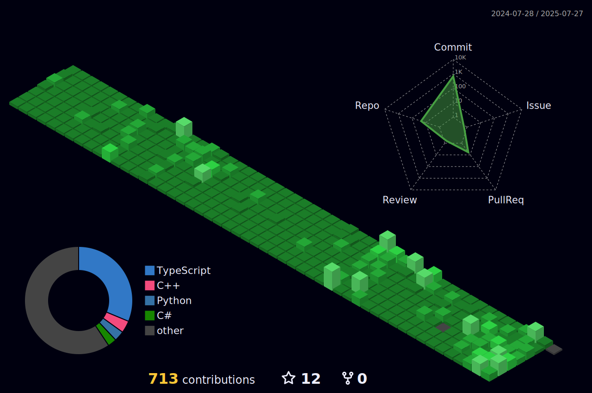

  
## What can I do?  
- Web : JS / TS / Next.js / pug / alpinejs / React.js / Phoenix
- App : React native cli / IOS Application / Android Application

---
  
## Projects
### 2022
- Good Block
  - [Sakura NFT](https://sakuranft.io/)
    - 중앙화 NFT 거래소 개발
    - 2022.11.07 ~ 2022.02.10 (프로젝트 시작일 ~ 출시일)
    - Frontend 개발 전담 / Next.js
  
  - [Good Block](https://www.good-block.com/)
    - Good Block 홈페이지 개발
    - 2022.12.05 ~ 2022.12.09 (프로젝트 시작일 ~ 출시일)
    - Frontend 개발 전담 / React.js

### 2023
  - CELEBUS
    - 글로벌 아티스트 팬덤을 위한 디지털 플랫폼 개발
    - [Google Play Store](https://play.google.com/store/apps/details?id=com.celebusapp)
      - 2022.03.07 ~ 2022.07.12 (프로젝트 시작일 ~ 출시일)
      - Android 앱 개발 전담 / React Native Cli
    - [Apple App Store](https://apps.apple.com/kr/app/celebus/id6451138533)
      - 2022.03.07 ~ 2022.07.20 (프로젝트 시작일 ~ 출시일)
      - IOS 앱 개발 전담 / React Native Cli
  
---

<!--  
<table align="center">
<tr>
<td valign="top">

</td>
<td valign="top">

</td>
</tr>
</table>

 
-->

<h3>Visitor count</h3>

<!--

-->

<!--
### Tech Stack

 

 
 
 
 
 

 

-->
